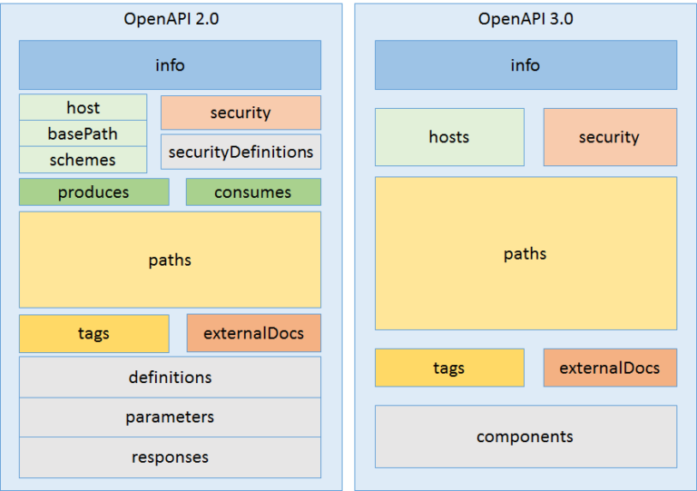

# Open API Specification  

OpenAPI规范（OpenAPI Specification 简称OAS）是Linux基金会的一个项目，  
试图通过定义一种用来描述API格式或API定义的语言，来规范RESTful服务开发过程。  

OpenAPI 基于 Swagger 2.0 构建，Swagger 是 SmartBear 贡献给 Linux 基金会的。  
意在构建具有中立管理模型的新组织，以引领 Swagger 更上一层楼。  

“开放 API 战略” 的创始成员包括对贡献具有兴趣的 Google、IBM 和 Microsoft。  
同时还成立了一个技术开发者社区（TDC，Technical Developer Community）以对规范做开发。  
TDC 对于任何有意向做出贡献的个人都是开放的，无需会员身份。

## OpenAPI 3

目前V3.0版本的OpenAPI规范（也就是SwaggerV2.0规范）已经发布并开源在github上。  
即swagger2.0是基于 The Apache License, Version 2.0许可的OAS3.0实现。  

  

* 改进点

为实现更好的可重用性，对规范的整体架构进行了重构，重构后的架构如图所示。  
支持 oneOf、anyOf 和 not 的 JSON 模式。  
可使用模式的参数。  
引入了 Cookie 参数，去除了 dataForm 参数。
具有自身实体的主体参数（Body Parameter）。  
可协商的内容类型。  
多主机支持。  
简化了安全定义，改进的 WebHooks 不再通过回调机制描述。  

## OpenAPI 规范目标

定义标准的、独立于语言的指向 REST API 的接口，使得服务能力无需访问源代码、文档，或是借助于网络流量检查，就可被人类和计算机发现并理解。  
通过对 OpenAPI 做适当定义后，消费者可使用最小数量的实现逻辑理解远程服务，并与远程服务交互。  

